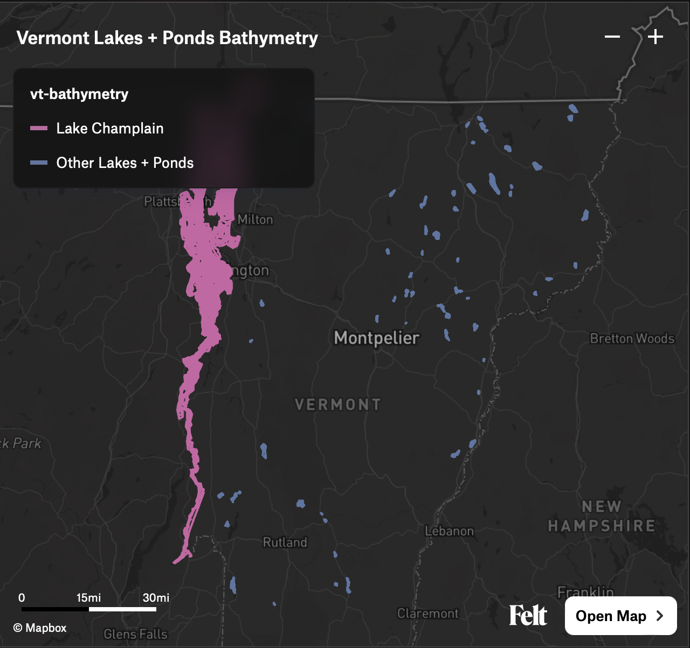

# Vermont Lakes + Ponds Bathymetry

Isobaths (underwater contour lines) generated for all Vermont lakes and ponds with available bathymetric data. Currently that's a small fraction of the actual lakes and ponds in Vermont.

The processed files:

- [Lake Champlain isobaths as GeoJSON](https://github.com/cboone/vermont-lakes-and-ponds-bathymetry/blob/main/bathymetry/champlain-bathymetry.geojson)
- [Vermont (non-Champlain) lake and pond isobaths as GeoJSON](https://github.com/cboone/vermont-lakes-and-ponds-bathymetry/blob/main/bathymetry/vt-bathymetry.geojson)
- [Combined bathymetry as PMTiles](https://github.com/cboone/vermont-lakes-and-ponds-bathymetry/blob/main/bathymetry/vt-combined-bathymetry.pmtiles)

View the combined bathymetry [on Felt](https://felt.com/map/Vermont-Lakes-Ponds-Bathymetry-dcDtYi3NT36UCpbrhi6udA) or via [the PMTiles Viewer](https://protomaps.github.io/PMTiles/?url=https%3A%2F%2Fraw.githubusercontent.com%2Fcboone%2Fvermont-lakes-and-ponds-bathymetry%2Fmain%2Fbathymetry%2Fvt-combined-bathymetry.pmtiles#map=6.16/44.397/-71.466).

[](https://felt.com/map/Vermont-Lakes-Ponds-Bathymetry-dcDtYi3NT36UCpbrhi6udA)

## Sources

### Lake Champlain

https://geodata.vermont.gov/datasets/7f451335fc6644e7a7376adbcd6282df_2/about

### Description

Lake Champlain Bathymetry points for general mapping purposes only.

The `ElevationDEM_LKCHDEM` data layer includes bathymetric data derived \[from\] NOAA nautical charts. All points were digitized from the RF 40,000 scale NOAA charts for Lake Champlain. The original data released in 1992 did not include information from Mallets Bay north and from the Crown Point bridge south. VCGI added data for these missing areas in 2003 by taking points from the LCBP data bundle (LAKEBATH). VCGI also replaced the shoreline points in 2010 using the shoreline as defined in the VHDCARTO dataset.

#### License

VCGI and the State of VT make no representations of any kind, including but not limited to the warranties of merchantability or fitness for a particular use, nor are any such warranties to be implied with respect to the data, service, or application.

### Vermont (non-Champlain) lakes + ponds

https://geodata.vermont.gov/datasets/VTANR::bathymetric-data/about

### Description

Table showing depth (ft) and location for various lakes and ponds in Vermont. Water depth is relative to pool elevation at the time of collection. Coordinates are in GCS, WGS84. Location data compiled on 8/12/2020.

### License

No license specified.

## Alternative: Combined tile server

Tile server: https://vcgi.maps.arcgis.com/home/item.html?id=d78e581061df41ff848bf46c920607ac

### Description

Single, statewide bathymetric dataset created by merging: 1) ElevationDEM_LKCHDEM the 1:40,000 based NOAA charts for Lake Champlain; and 2) Vermont Agency of Natural Resources "Bathymetric Data" released in early 2021 and based on August 2020 data. Utilizes a hybrid symbol/label cartographic approach to best represent the 2.5+ million data points. Depth labeled points begin rendering at Google zoom Level L13 (1:72,224).

NOTE: The ElevationDEM_LKCHDEM points are based on older, smaller resolution (1:40k) data and depths based on NGVD 1929. The Vermont Agency of Natural Resources "Bathymetric Data" points have water depth values relative to pool elevation at the time of collection, i.e., they do not share a common vertical baseline.

### Credits / attribution

```
NOAA, VCGI, VT ANR, VT DEC
```

### License

VCGI and the State of VT make no representations of any kind, including but not limited to the warranties of merchantability or fitness for a particular use, nor are any such warranties to be implied with respect to the data.

## Running the scripts

### Requirements

- `ogr2ogr` (comes with [GDAL](https://gdal.org))
- [My fork of the QGIS contour plugin](https://github.com/cboone/QGIS-Contour-Plugin)
- `qgis_process` (comes with [QGIS](https://qgis.org/))
